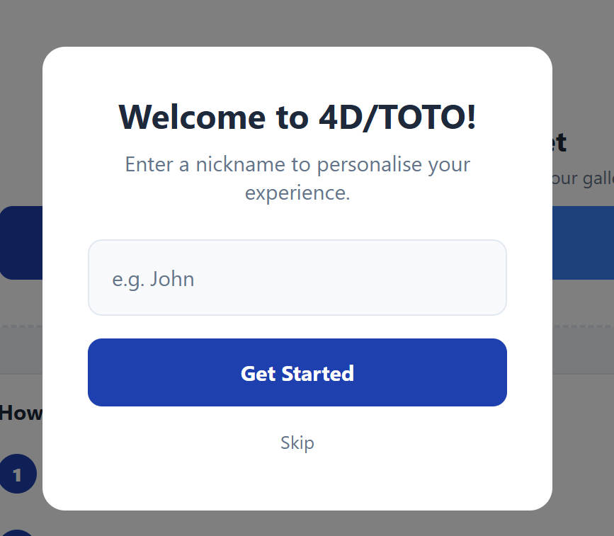
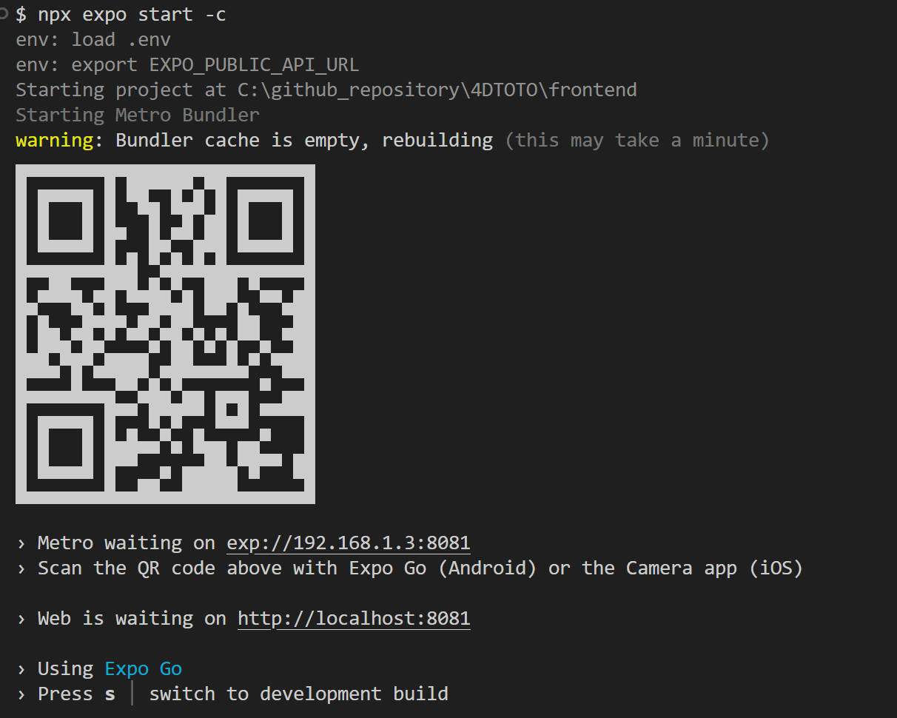
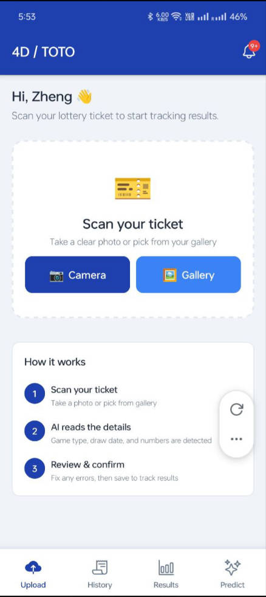

# Section 3 — Running the Application

← [Installation](02-installation.md) | [Back to Manual](../../USER_MANUAL.md) | [Next: Usage Walkthrough →](04-usage-walkthrough.md)

---

## Starting the Backend

### Option A — Direct (manual setup)

```bash
cd backend
# Activate your virtual environment if you created one
source .venv/bin/activate   # macOS/Linux
.venv\Scripts\activate      # Windows

npm run dev
# This runs: python -m uvicorn main:app --reload --host 0.0.0.0 --port 8000
# The dev script is defined in backend/package.json as a convenience shortcut.
```

Expected output:
```
INFO:     Started server process [xxxxx]
INFO:     Waiting for application startup.
INFO:     Application startup complete.
INFO:     Uvicorn running on http://0.0.0.0:8000
```

On first start, the backend automatically begins seeding historical 4D and TOTO draw results in the background. This may take a few minutes (it scrapes Singapore Pools draw history with rate-limiting delays). You can use the app immediately — seeding runs concurrently.

### Option B — Docker Compose

```bash
# From project root
docker-compose up
```

To rebuild after code changes:
```bash
docker-compose up --build
```

To stop:
```bash
docker-compose down          # stops containers
docker-compose down -v       # stops + deletes database volume (full reset)
```

---

## Running the Web App

### Development server

```bash
cd frontend
npx expo start
```

This starts the Expo Metro bundler. Press **W** to open the web app at **http://localhost:8081**, or scan the QR code with Expo Go for mobile.




On first launch, a welcome modal asks for your name. This is stored locally and used to personalise the greeting on the Upload screen. It is never sent to the server.

### Production web build

```bash
cd frontend
npm run build:web
```

Output is written to `frontend/dist/`. You can serve it with any static file server:

```bash
# Quick local preview with npx serve
npx serve frontend/dist

# Or with Python
python -m http.server 8080 --directory frontend/dist
```

---

## Running the Mobile App (Expo Go)

### Requirements
- Expo Go installed on your device (see [Prerequisites](01-prerequisites.md))
- Your phone and computer on the **same Wi-Fi network**

### Steps

1. Start the Expo dev server:
```bash
cd frontend
npx expo start
```

2. A QR code appears in the terminal.



3. On your device:
   - **Android:** Open Expo Go → tap **Scan QR code**
   - **iOS:** Open the Camera app → point at the QR code → tap the Expo Go banner

4. The app loads on your device. Any code changes you save are reflected immediately (hot reload).




### Troubleshooting mobile connection

If the app shows "Cannot reach API":
1. Ensure your phone and computer are on the same network
2. Check that `EXPO_PUBLIC_API_URL` in `frontend/.env` uses your computer's local IP (not `localhost`)
3. Ensure port 8000 is not blocked by a firewall

---

## Verifying the Backend is Running

Open **http://localhost:8000/health** in your browser. You should see:
```json
{"status": "ok"}
```

API interactive documentation (Swagger UI) is available at:
**http://localhost:8000/docs**

---

[Next: Usage Walkthrough →](04-usage-walkthrough.md)
