# Section 4 — Usage Walkthrough

← [Running the App](03-running.md) | [Back to Manual](../../USER_MANUAL.md) | [Next: Testing →](05-testing.md)

---

The app has four tabs: **Upload**, **History**, **Results**, and **Predict**.

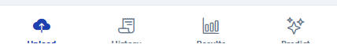

---

## 4a. Uploading a Ticket

The Upload tab is where you scan a physical lottery ticket to start tracking its result.

### Step 1 — Select an image

On first load the Upload tab shows two buttons: **Take Photo** and **Pick from Gallery**.

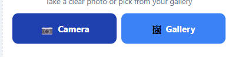

- **Take Photo** — opens your device camera. Point at your ticket and capture it.
- **Pick from Gallery** — opens your photo library to choose an existing ticket photo.

> **Tip:** Photograph the ticket in good lighting with the entire ticket visible. Blurry or cropped images reduce OCR accuracy.

### Step 2 — Review the image

After selecting, the image is displayed with three buttons below it: **Retake**, **Change**, and **Clear**.

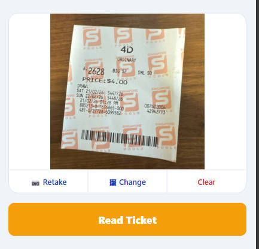

- **Retake** — opens the camera again to take a new photo
- **Change** — opens the gallery to pick a different image
- **Clear** — removes the image and returns to the upload zone

Press **Read Ticket** to send the image to the backend for OCR processing.

### Step 3 — Wait for OCR

A loading indicator is shown while the image is processed. This typically takes 5–20 seconds depending on Gemini API response time.

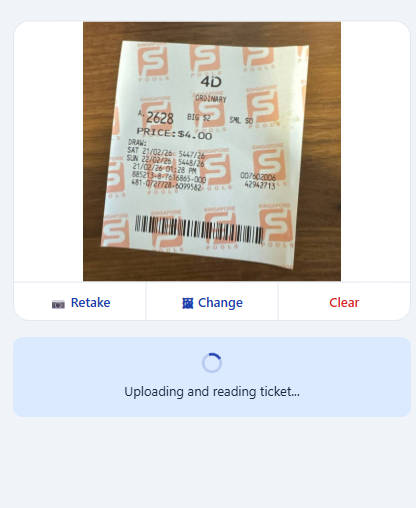

### Step 4 — Review and correct OCR results

After OCR completes, a review form is shown with the extracted fields pre-filled. Fields with lower OCR confidence are highlighted in amber.

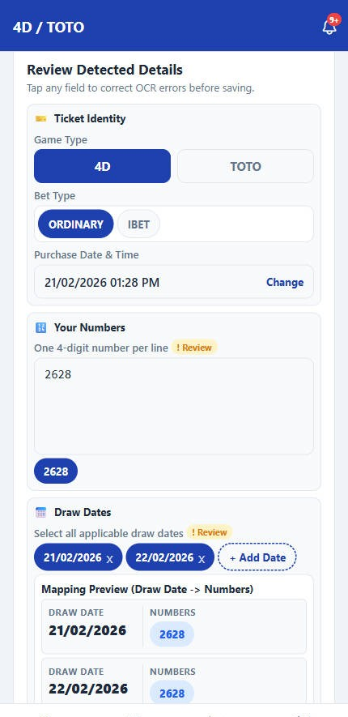

**Fields to review:**

| Field | Description |
|-------|-------------|
| Game Type | `4D` or `TOTO` — auto-detected from ticket |
| Draw Date(s) | The draw date(s) on the ticket. For multi-draw tickets, multiple dates appear |
| Draw Number | The Singapore Pools draw number (e.g., `5447`) |
| Bet Type | `ORDINARY`, `IBET` (4D), or `SYSTEM_7` through `SYSTEM_12` (TOTO) |
| Numbers | The number(s) you selected on the ticket |
| Big / Small Amount | For 4D tickets — bet amount per category |
| Purchase Date/Time | When you bought the ticket |

Edit any field that looks incorrect before confirming.

> **Note:** If OCR fails completely (e.g., blurry image), all fields are left blank and you can fill them in manually.

### Step 5 — Confirm

Once satisfied with the fields, press **Confirm Ticket**. A summary shows how many ticket entries were created and their initial result status.

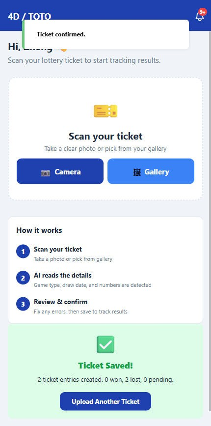

The ticket is now saved and result-checking begins automatically.

---

## 4b. Checking Ticket History

The **History** tab lists all your saved tickets.

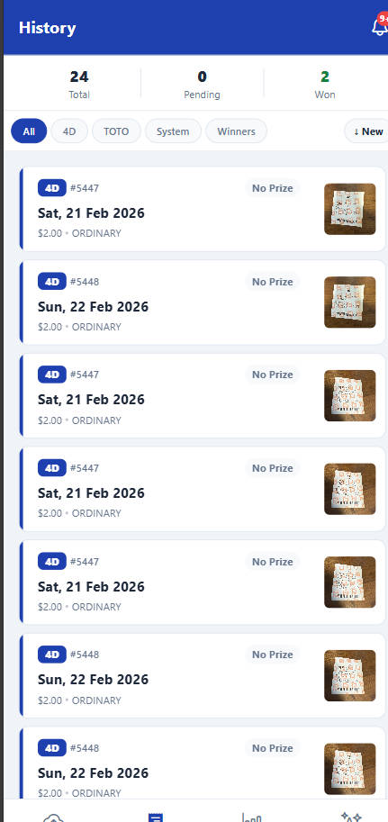

### Reading a ticket card

Each card shows:
- **Thumbnail** — small preview of the ticket image
- **Game type badge** — `4D` or `TOTO`
- **Draw date** and draw number
- **Status badge** — `PENDING` (grey), `WON` (green), `LOST` (red), `NO RESULT` (amber)
- **Numbers** — your selected numbers
- **Prize tier** — shown for winning tickets (e.g., "1st Prize", "Consolation")

### Sorting and filtering

Use the **Sort** and **Filter** controls at the top to narrow the list:

- Sort by: **Newest** or **Winning first**
- Filter by: **All**, **4D only**, **TOTO only**, **System bets**, or **Winners only**

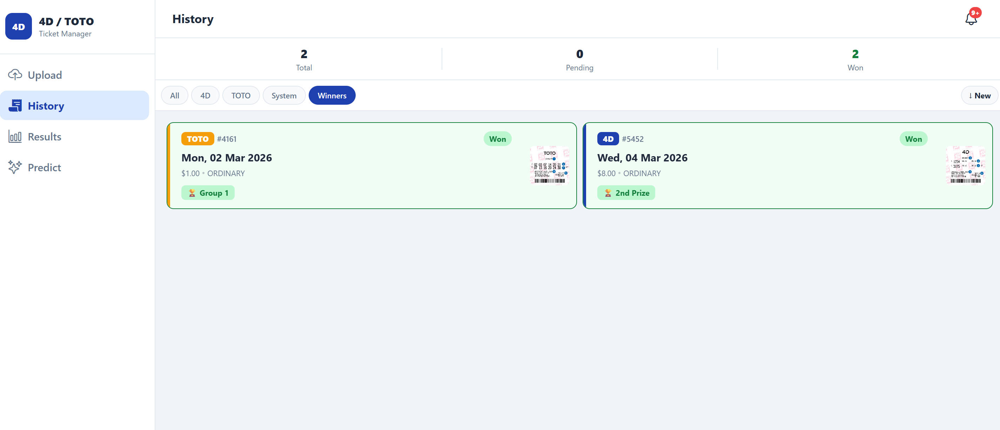

### Win/loss notifications

When a result becomes available for a pending ticket, a toast notification appears the next time the History tab is open. Winning tickets also show a prominent prize tier badge.

### Viewing ticket details

Tap any ticket card to open the **Ticket Detail** screen.

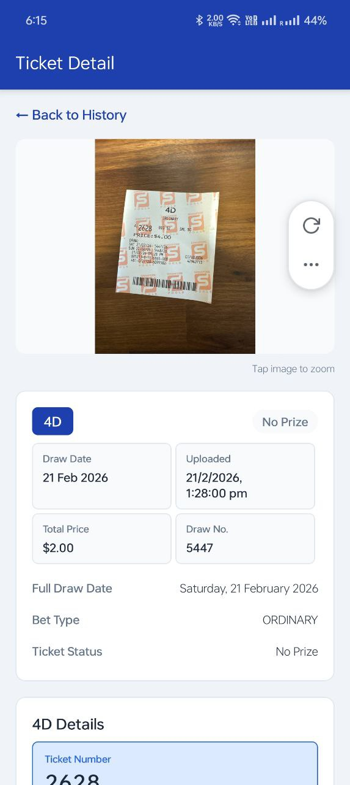

The detail screen shows:
- Full ticket image
- All stored ticket fields
- For TOTO System bets: all expanded number combinations (e.g., C(7,6) = 7 combinations for System 7)
- Raw OCR text (expandable, for verification)
- Win/loss result with prize tier if available

---

## 4c. Viewing Draw Results

The **Results** tab shows all cached Singapore Pools draw results.

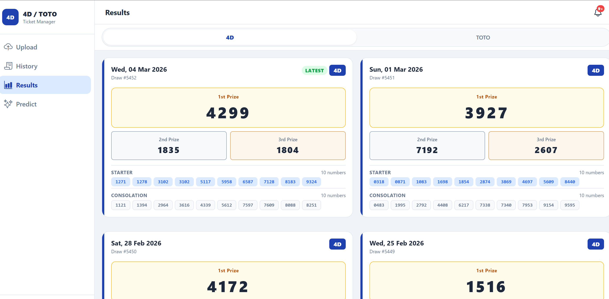

### Browsing results

Results are paginated. Use the **Load More** button to fetch older draws.

Use the **4D / TOTO** toggle at the top to filter by game type.

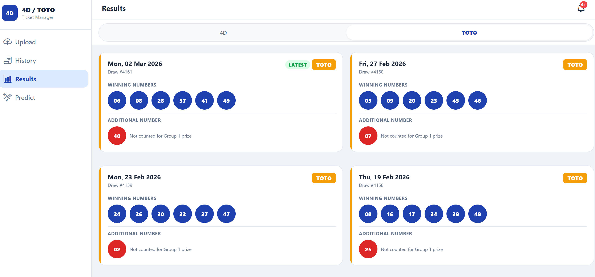

### Reading a 4D result

Each 4D result card shows:
- Draw date and draw number
- **1st, 2nd, 3rd Prize** numbers
- **10 Starter** numbers
- **10 Consolation** numbers

### Reading a TOTO result

Each TOTO result card shows:
- Draw date and draw number
- **6 Winning numbers** + **1 Additional number**
- Prize amounts for each tier (if available)

### Result availability

- **Past draws:** Fetched immediately from Singapore Pools on demand.
- **Future/pending draws:** Checked every 30 minutes by the background scheduler. The status badge on your ticket updates automatically when results are published.

---

## 4d. Using the Prediction Page

The **Predict** tab shows number suggestions generated by three statistical models.

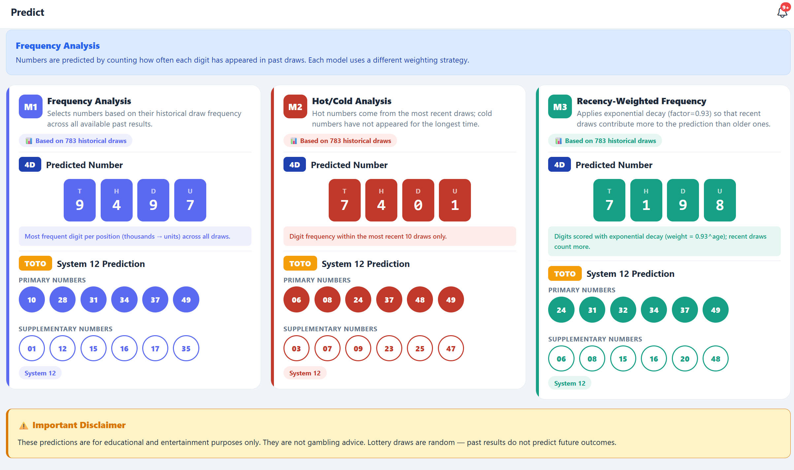

> ⚠️ **Important:** These are statistical summaries of historical data — not predictions. Lottery draws are random. Past results have zero influence on future draws. See [Section 7 — Prediction Models Guide](07-predictions-guide.md) for full methodology.

### Reading a prediction card

Each card shows:
- **Model name and description**
- **4D prediction** — a 4-digit number (e.g., `3847`)
- **TOTO prediction** — 12 numbers in System 12 format (6 primary + 6 supplementary)
- **Data points** — how many historical draws were used
- **Disclaimer**

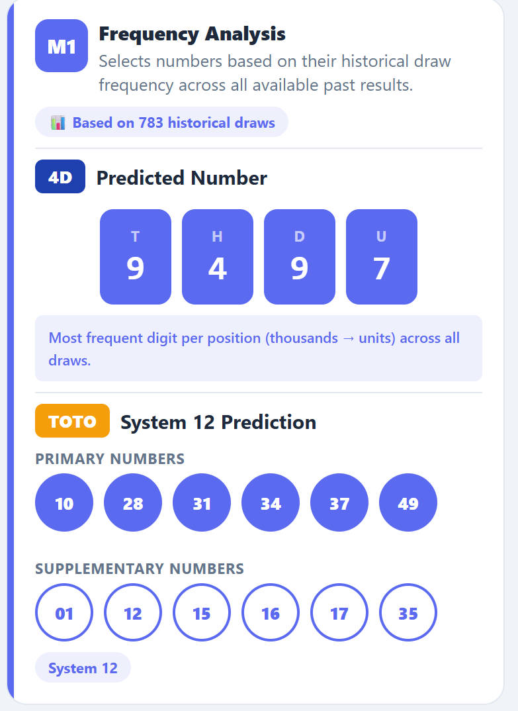

### Three models

| Model | What it does |
|-------|-------------|
| Frequency Analysis | Picks the digits/numbers drawn most often across all history |
| Hot/Cold Analysis | Primary = recently active numbers; Supplementary = numbers absent the longest |
| Recency-Weighted Frequency | Same as frequency analysis but recent draws count more (exponential decay) |

For full details, see [Section 7 — Prediction Models Guide](07-predictions-guide.md).

---

[Next: Manual Testing Guide →](05-testing.md)
